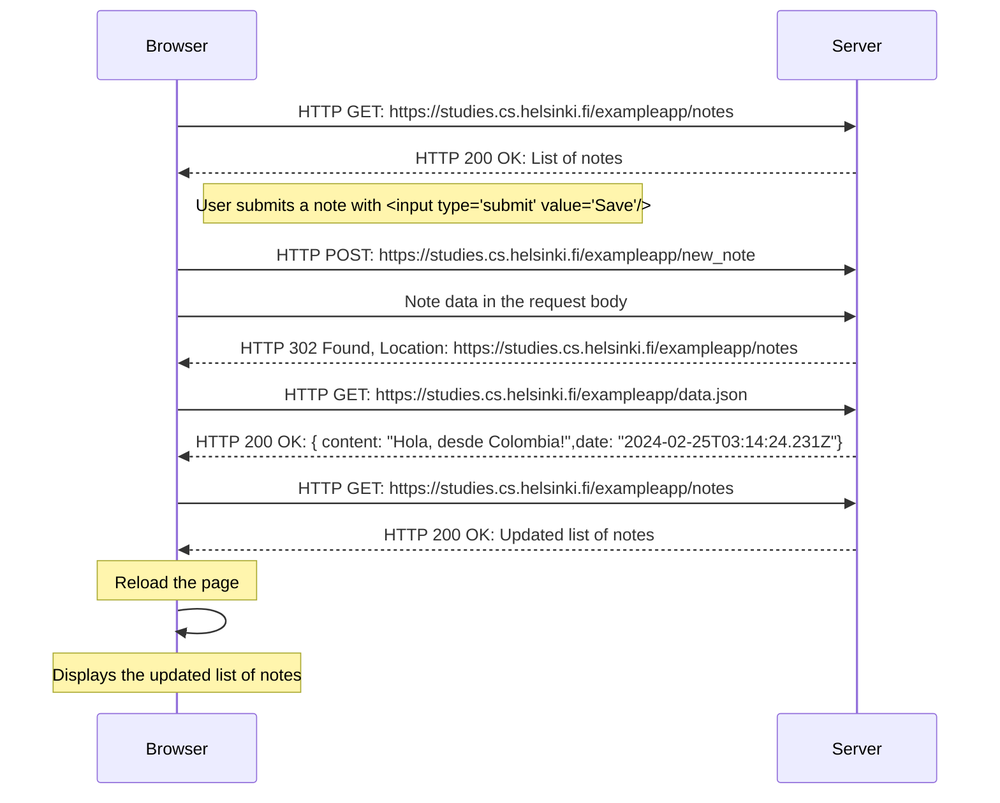

```mermaid
    sequenceDiagram

        participant Browser
        participant Server

        Browser ->> Server: HTTP GET: https://studies.cs.helsinki.fi/exampleapp/notes
        Server -->> Browser: HTTP 200 OK: List of notes

        Note right of Browser: User submits a note with <input type="submit" value="Save"/>

        Browser ->> Server: HTTP POST: https://studies.cs.helsinki.fi/exampleapp/new_note
        Browser ->> Server: Note data in the request body

        Server -->> Browser: HTTP 302 Found, Location: https://studies.cs.helsinki.fi/exampleapp/notes

        Browser ->> Server: HTTP GET: https://studies.cs.helsinki.fi/exampleapp/data.json

        Server -->> Browser: HTTP 200 OK: { content: "Hola, desde Colombia!",date: "2024-02-25T03:14:24.231Z"}
        Browser ->> Server: HTTP GET: https://studies.cs.helsinki.fi/exampleapp/notes

        Server -->> Browser: HTTP 200 OK: Updated list of notes

        Note over Browser: Reload the page
        Browser ->> Browser: 

        Note over Browser: Displays the updated list of notes

```