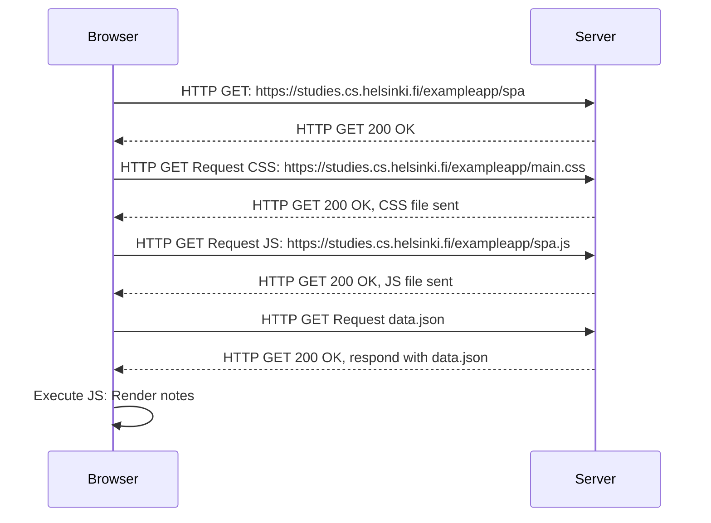

```mermaid
    sequenceDiagram

        participant Browser
        participant Server

        Browser ->> Server: HTTP GET: https://studies.cs.helsinki.fi/exampleapp/spa
        Server -->> Browser: HTTP GET 200 OK

        Browser ->> Server: HTTP GET Request CSS: https://studies.cs.helsinki.fi/exampleapp/main.css
        Server -->> Browser: HTTP GET 200 OK, CSS file sent

        Browser ->> Server: HTTP GET Request JS: https://studies.cs.helsinki.fi/exampleapp/spa.js
        Server -->> Browser: HTTP GET 200 OK, JS file sent

        Browser ->> Server: HTTP GET Request data.json
        Server -->> Browser: HTTP GET 200 OK, respond with data.json

        Browser ->> Browser: Execute JS: Render notes
```