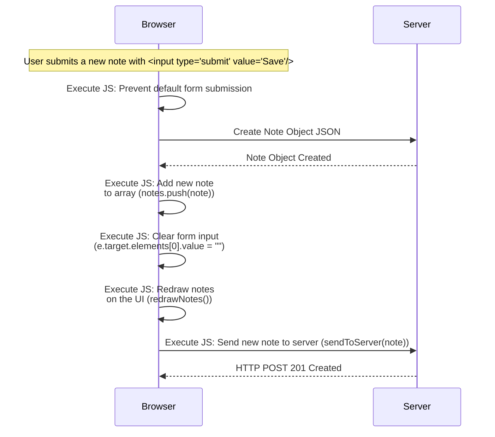

```mermaid
    sequenceDiagram

        participant Browser
        participant Server

        Note over Browser: User submits a new note with <input type="submit" value="Save"/>

        Browser ->> Browser: Execute JS: Prevent default form submission

        Browser ->> Server: Create Note Object JSON
        Server -->> Browser: Note Object Created

        Browser ->> Browser: Execute JS: Add new note <br/> to array (notes.push(note))

        Browser ->> Browser: Execute JS: Clear form input<br/> (e.target.elements[0].value = "")

        Browser ->> Browser: Execute JS: Redraw notes<br/> on the UI (redrawNotes())

        Browser ->> Server: Execute JS: Send new note to server (sendToServer(note))

        Server -->> Browser: HTTP POST 201 Created
```